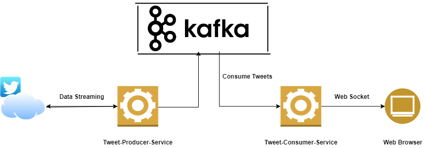

# **This web application developed in Spring-boot 2.6.x framework, using Java 11 version**

###### **Application Functionality**

This application is consuming tweets from Kafka cluster. Producer (another soring-boot service) is streaming tweets and 
pushing to kafka topics. This project works as Kafka consumer and listener will always consume data as soon as its available in topic.

**Websocket** is used to consume data through the kafka listener service and show on web browser.

###### Complete Project Architecture (High Level)

###### Current Project Scope

###### **Prerequisite**

To run this application make sure you have connectivity with Kafka broker server.
Currently master branch is connecting to localhost that means kafka broker server should be up and running locally.

Another branch `karan/CloudSetup` is in progress to connect with Kafka brokers running on cloud.
 
Command to run project locally::
mvn spring-boot:run

